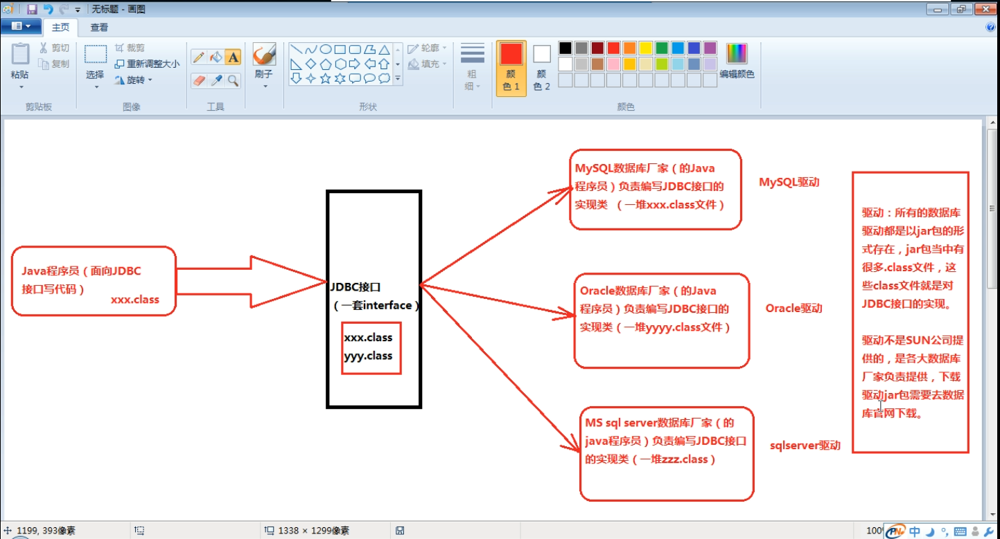

### 复习反射、map两个类


### jdbc基础

##### 1、jdbc的本质理解

一套接口



##### 2、面向接口编程，SUN公司制定的一套接口,配置到classpath中

使用文本编辑器需要配置classpath，idea可以图形化配置

classpath = .;xxxxx\MySql Connector Java 5.1.23.rar

##### 3、使用IDEA工具的时候，不需要配置以上的环境变量。

##### 4、JDBC编程六步（需要背）

第一步：注册驱动（作用：告诉Java程序，即将要连接的是哪个品牌的数据库）

第二步：获取连接（表示JVM的进程和数据库进程之间的通道打开了，这属于进程之间的通信，重量级的，使用完之后一定要关闭通道。）

第三步：获取数据库操作对象（专门执行sql语句的对象）

第四步：执行SQL语句（DQL DML....）

第五步：处理查询结果集（只有当第四步执行的是select语句的时候，才有这第五步处理查询结果集。）

第六步：释放资源（使用完资源之后一定要关闭资源。Java和数据库属于进程间的通信，开启之后一定要关闭。）

##### 5、JDBC编程六步样例代码

```java
public class test {
    public static void main(String[] args) {
        ResourceBundle bundle = ResourceBundle.getBundle("jdbc");
        String driver = bundle.getString("driver");
        String url = bundle.getString("url");
        String user = bundle.getString("user");
        String password = bundle.getString("password");


        Connection conn = null;
        Statement stmt = null;
        try {
            //1、注册驱动
            Class.forName(driver);
            //2、获取连接
            conn = DriverManager.getConnection(url,user,password);
            //3、获取数据库操作对象
            stmt = conn.createStatement();
            //4、执行sql语句
            String sql = "update dept set dname = '销售部2', loc = '天津' where deptno = 20";
            int count = stmt.executeUpdate(sql);
            System.out.println(count == 1 ? "修改成功" : "修改失败");
            //5、处理查询结果

        }catch (Exception e){
            e.printStackTrace();
        }finally{
            //6、释放连接
            if(stmt != null ){
                try{
                    stmt.close();
                }catch (SQLException e){
                    e.printStackTrace();
                }
            }
            if(conn != null ){
                try{
                    conn.close();
                }catch (SQLException e){
                    e.printStackTrace();
                }
            }
        }
    }
}
```

配置文件

```properties
driver=com.mysql.jdbc.Driver
url=jdbc:mysql://localhost:3306/bjpowernode
user=root
password=123456
```

##### 6、简单的用户登录模拟

数据库建立

```mysql
drop table if exists t_user;

/*==============================================================*/
/* Table: t_user                                                */
/*==============================================================*/
create table t_user
(
   id                   bigint auto_increment,
   loginName            varchar(255),
   loginPwd             varchar(255),
   realName             varchar(255),
   primary key (id)
);

INSERT INTO t_user(loginName, loginPwd, realName) VALUES('zhangsan', '123', '张三');
INSERT INTO t_user(loginName, loginPwd, realName) VALUES('admin', '123', '管理员');
INSERT INTO t_user(loginName, loginPwd, realName) VALUES('wzc', '123', '王子朝');
commit;
SELECT * FROM t_user;
```

java，Statement使用代码

```java
package com.wzc.jdbc;

import java.sql.*;
import java.util.HashMap;
import java.util.Map;
import java.util.Scanner;

public class login_test {
    public static void main(String[] args) {
        //初始化界面
        Map<String ,String> userLoginInfo = initUI();
        //验证用户名密码
        boolean loginSuccess = login(userLoginInfo);
        //输出结果
        System.out.println(loginSuccess ? "登录成功" : "登陆失败");

    }

    private static boolean login(Map<String, String> userLoginInfo) {
        //标记变量
        boolean loginSuccess = false;

        String loginName = userLoginInfo.get("loginName");
        String loginPwd = userLoginInfo.get("loginPwd");

        //JDBC代码
        Connection conn = null;
        Statement stmt = null;
        ResultSet rs = null;

        try {
            //1、注册驱动
            Class.forName("com.mysql.jdbc.Driver");
            //2、获取链接
            conn = DriverManager.getConnection("jdbc:mysql://localhost:3306/bjpowernode", "root", "123456");
            //3、获取数据库操作对象
            stmt = conn.createStatement();
            //4、执行sql语句
            String sql = "select * from t_user where loginName = '"+loginName+"' and loginPwd = '"+loginPwd+"'";
            rs = stmt.executeQuery(sql);
            //5、处理结果
            if(rs.next()){
                loginSuccess = true;
            }
        }catch (Exception e){
            e.printStackTrace();
        }finally {
            if(rs != null){
                try {
                    rs.close();
                } catch (SQLException e) {
                    throw new RuntimeException(e);
                }
            }
            if(stmt != null){
                try {
                    stmt.close();
                } catch (SQLException e) {
                    throw new RuntimeException(e);
                }
            }
            if(conn != null){
                try {
                    conn.close();
                } catch (SQLException e) {
                    throw new RuntimeException(e);
                }
            }
        }
        return loginSuccess;
    }

    private static Map<String, String> initUI() {
        Scanner s = new Scanner(System.in);

        System.out.println("用户名: ");
        String loginName = s.nextLine();

        System.out.println("密码: ");
        String loginPwd = s.nextLine();

        Map<String, String> userLoginInfo = new HashMap<>();
        userLoginInfo.put("loginName", loginName);
        userLoginInfo.put("loginPwd", loginPwd);

        return userLoginInfo;
    }


}
```

使用PreparedStatement解决sql注入问题

```java
package com.wzc.jdbc;
//预防sql注入

/**
 *  1、解决SQL注入问题？
 *       只要用户提供的信息不参与SQL语句的编译过程，问题就解决了。
 *       即使用户提供的信息中含有SQL语句的关键字，但是没有参与编译，不起作用。
 *       要想用户信息不参与SQL语句的编译，那么必须使用java.sql.PreparedStatement
 *       PreparedStatement接口继承了java.sql.Statement
 *       PreparedStatement是属于预编译的数据库操作对象。
 *       PreparedStatement的原理是：预先对SQL语句的框架进行编译，然后再给SQL语句传“值”。
 *  2、测试结果：
 *       用户名：fdas
 *       密码：fdsa' or '1'='1
 *       登录失败
 *  3、解决SQL注入的关键是什么？
 *       用户提供的信息中即使含有sql语句的关键字，但是这些关键字并没有参与编译。不起作用。
 *  4、对比一下Statement和PreparedStatement?
 *       - Statement存在sql注入问题，PreparedStatement解决了SQL注入问题。
 *       - Statement是编译一次执行一次。PreparedStatement是编译一次，可执行N次。PreparedStatement效率较高一些。
 *       - PreparedStatement会在编译阶段做类型的安全检查。
 *
 *       综上所述：PreparedStatement使用较多。只有极少数的情况下需要使用Statement
 *  5、什么情况下必须使用Statement呢？
 *       业务方面要求必须支持SQL注入的时候。
 *       Statement支持SQL注入，凡是业务方面要求是需要进行sql语句拼接的，必须使用Statement。
 */

import java.sql.*;
import java.util.HashMap;
import java.util.Map;
import java.util.Scanner;

public class test02 {
    public static void main(String[] args) {
        //初始化界面
        Map<String ,String> userLoginInfo = initUI();
        //验证用户名密码
        boolean loginSuccess = login(userLoginInfo);
        //输出结果
        System.out.println(loginSuccess ? "登录成功" : "登陆失败");

    }

    private static boolean login(Map<String, String> userLoginInfo) {
        //标记变量
        boolean loginSuccess = false;

        String loginName = userLoginInfo.get("loginName");
        String loginPwd = userLoginInfo.get("loginPwd");

        //JDBC代码
        Connection conn = null;
        PreparedStatement ps = null;
        ResultSet rs = null;

        try {
            //1、注册驱动
            Class.forName("com.mysql.jdbc.Driver");
            //2、获取链接
            conn = DriverManager.getConnection("jdbc:mysql://localhost:3306/bjpowernode", "root", "123456");
            //3、获取预处理的数据库操作对象
            // SQL语句的框子。其中一个?，表示一个占位符，一个?将来接收一个“值”，注意：占位符不能使用单引号括起来。
            String sql = "select * from t_user where loginName = ? and loginPwd = ?";
            // 程序执行到此处，会发送sql语句框子给DBMS，然后DBMS进行sql语句的预先编译。
            ps = conn.prepareStatement(sql);
            // 给占位符?传值（第1个问号下标是1，第2个问号下标是2，JDBC中所有下标从1开始。）
            ps.setString(1, loginName);
            ps.setString(2, loginPwd);
            //4、执行sql语句
            rs = ps.executeQuery();
            //5、处理结果
            if(rs.next()){
                // 登陆成功
                loginSuccess = true;
            }
        }catch (Exception e){
            e.printStackTrace();
        }finally {
            if(rs != null){
                try {
                    rs.close();
                } catch (SQLException e) {
                    throw new RuntimeException(e);
                }
            }
            if(ps != null){
                try {
                    ps.close();
                } catch (SQLException e) {
                    throw new RuntimeException(e);
                }
            }
            if(conn != null){
                try {
                    conn.close();
                } catch (SQLException e) {
                    throw new RuntimeException(e);
                }
            }
        }
        return loginSuccess;
    }

    private static Map<String, String> initUI() {
        Scanner s = new Scanner(System.in);

        System.out.println("用户名: ");
        String loginName = s.nextLine();

        System.out.println("密码: ");
        String loginPwd = s.nextLine();

        Map<String, String> userLoginInfo = new HashMap<>();
        userLoginInfo.put("loginName", loginName);
        userLoginInfo.put("loginPwd", loginPwd);

        return userLoginInfo;
    }

}
```

