### 1、卸载之前版本(分安装包和zip)

##### <u>*a：如果之前是msi格式安装*</u>

1、双击安装包，然后 remove	或者通过控制面板卸载

2、结束后删除C:\ProgramData\MySQL（隐藏文件夹）和C:\Program Files (x86)\MySQL 

完成这两步后才会彻底删除

##### <u>*b：如果之前是zip格式安装*</u>

**1、关闭MySQL服务**

以管理员身份运行cmd ，执行下面命令

```bash
net stop 服务器名称	#我本机是mysql2和MYSQL5

net stop mysql2
net stop MYSQL5
```

**2、删除MySQL目录文件（本地）**

**3、命令端 删除MySQL服务**

​    删除windows中的MySQL服务（MySQL是服务名）

```sql
sc delete 服务器名称	#我本机是mysql2和MYSQL5
```

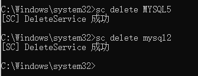

**4、删除注册表信息**

开始---->运行---> regedit ,进入注册表

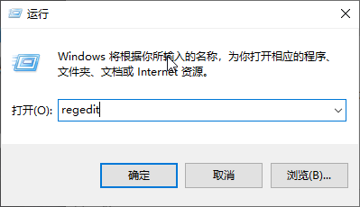

删除注册表里面以下这几个地方 :

①、HEKY_LOCAL_MACHINE\SOFTWARE\MYSQL

②、HKEY_LOCAL_MACHINE\SYSTEM\ControlSet001\Services\Eventlog\Application\MySQL

③、HKEY_LOCAL_MACHINE\SYSTEM\ControlSet002\Services\Eventlog\Application\MySQL

④、HKEY_LOCAL_MACHINE\SYSTEM\CurrentControlSet\Services\Eventlog\Application\MySQL

可能有的文件没有，可能有的文件名是mysql server，删了就行

注册表中的ControlSet001、ControlSet002不一定是001和002，可能是ControlSet005、006之类，删除的时候，都删除就可以。

**5、删除系统变量**


### 2、zip安装mysql5和mysql8

mysqld命令相关介绍

```bash
–console //写错误日志到console window平台

–defaults-file //默认配置文件

–flush //刷新改变到磁盘

–initialize //创建数据文件目录和mysql系统数据库 产生随机root密码

–initialize-insecure //创建数据文件目录和mysql系统数据库 产生空root密码

–init-file //初始化后要执行的文件

–install //安装mysqld作为window服务 自动启动

–install-manual //安装mysqld作为window服务 手动启动

–remove //删除window服务

mysqld --install mysql5 --defaults-file="D:\develop\mysql\mysql\mysql-5.7.40-winx64\my.ini"
mysqld --initialize-insecure
net start mysql5
mysql -u root -P 3306 -h localhost -p
ALTER USER 'root'@'localhost' IDENTIFIED WITH mysql_native_password BY '123456';
flush privileges;

mysqld --install mysql8 --defaults-file="D:\develop\mysql\mysql\mysql-8.0.25-winx64\my.ini"
mysqld --initialize-insecure
net start mysql8
mysql -u root -P 3307 -h localhost -p
ALTER USER 'root'@'localhost' IDENTIFIED WITH mysql_native_password BY '123456';
flush privileges;
```

##### 1、*首先下载mysql5和mysql8的zip*

a、进入官网，选择下载

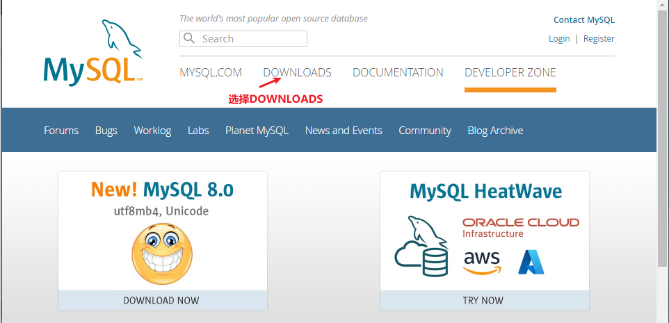

b、进入下载

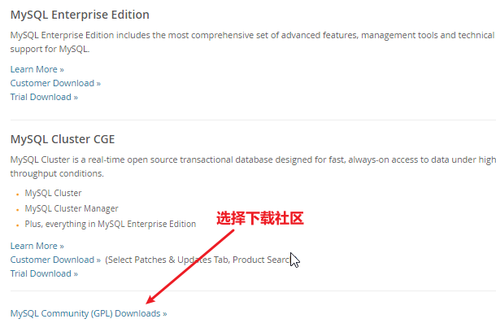

c、选择进入[MySQL Community Server](https://dev.mysql.com/downloads/mysql/)

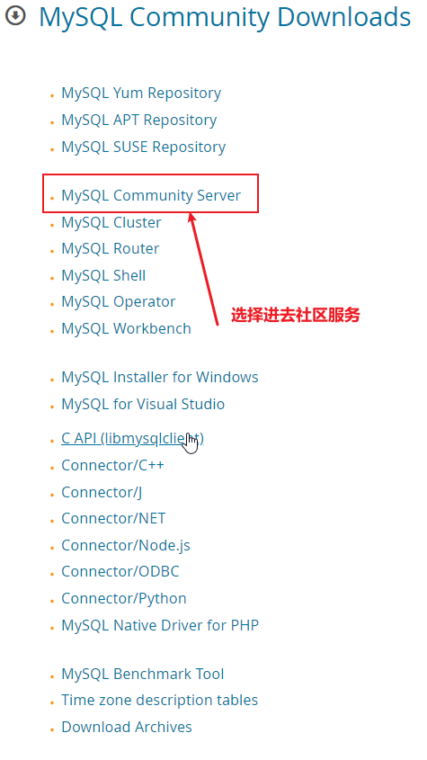

d、进去下载zip，分别下载5系列和8系列的zip

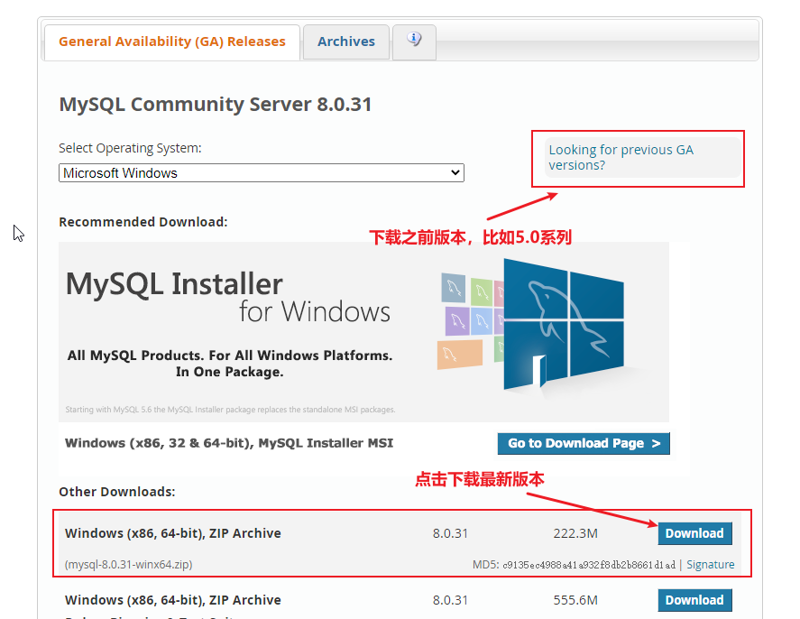

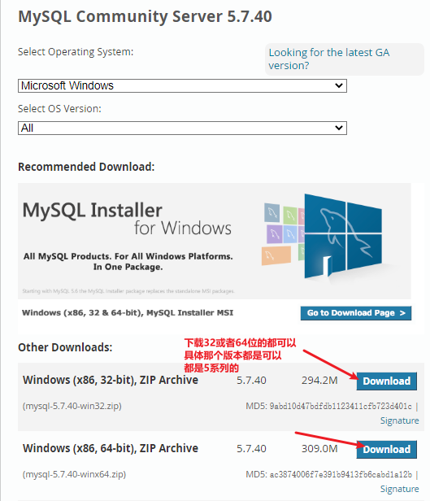

注意：安装完之后，安装哪个解压哪个不要同时把两个都解压到一个文件夹！！

最好，安装5的时候解压5，安装6的时候解压6

##### 2、*mysql5安装*

1、解压Mysql5.7，并且新建一个my.ini文件

（复制下面内容到my.ini，更改basedir= 和datadir= 以及你要的端口）


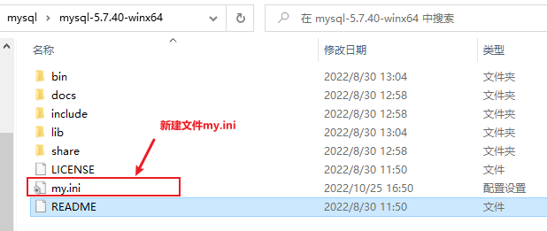

```bash
[mysql]
# 设置mysql客户端默认字符集
default-character-set=utf8
[mysqld]
# 设置3306端口
port = 3306
# 设置mysql的安装目录
basedir=D:\\develop\\mysql\\mysql\\mysql-5.7.40-winx64
# 设置mysql数据库的数据的存放目录（自动生成，不然可能报错）
datadir=D:\\develop\\mysql\\mysql\\mysql-5.7.40-winx64\\data
# 允许最大连接数
max_connections=10000
# 允许最大连接人数
max_user_connections=1000
# 服务端使用的字符集默认为8比特编码的latin1字符集
character-set-server=utf8
# 创建新表时将使用的默认存储引擎
default-storage-engine=INNODB
 
# 连接时间一年
wait_timeout=31536000
interactive_timeout=31536000
```

2.进行mysql的安装或者初始化（用管理员打开，切换到对应安装bin目录下）

```bash
C:\Windows\system32>d:

D:\>cd D:\develop\mysql\mysql\mysql-5.7.40-winx64\bin

D:\develop\mysql\mysql\mysql-5.7.40-winx64\bin>mysqld --install mysql5 --defaults-file="D:\develop\mysql\mysql\mysql-5.7.40-winx64\my.ini"
Service successfully installed.
```

```bash
mysqld --install 服务器名称 --defaults-file="my.ini配置文件的路径"
```

此时会弹出一个Service successful install;

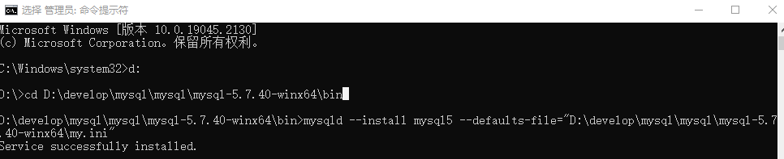

3.生成data文件（如果有你就删除）
以管理员身份打开cmd，切换到bin目录下输入命令：创建数据文件目录和mysql系统数据库 产生空root密码

```bash
mysqld --initialize-insecure
```

4 启动mysql

```bash
D:\develop\mysql\mysql\mysql-5.7.40-winx64\bin>net start mysql5
```

5.登陆mysql5并修改密码

```bash
mysql -u root -P 3306 -h localhost -p
ALTER USER 'root'@'localhost' IDENTIFIED WITH mysql_native_password BY '123456';
```

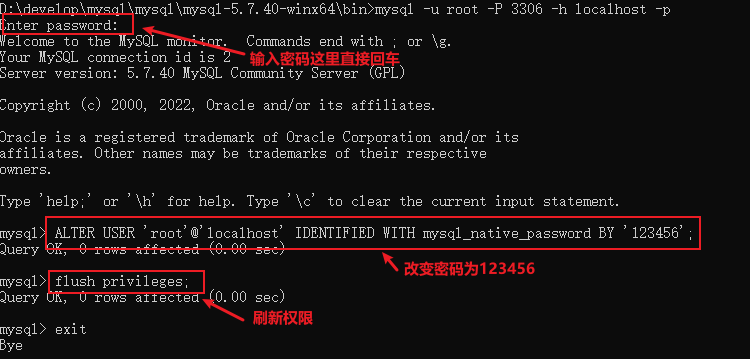

6.刷新权限

```
flush privileges;
```

mysql5就安装完了

##### 3、*mysql8安装*

1、解压Mysql8，并且新建一个my.ini文件

（复制下面内容到my.ini，更改basedir= 和datadir= 以及你要的端口）

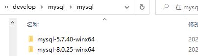


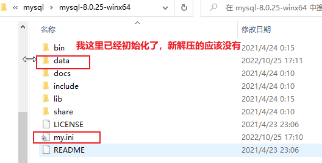

```bash
[mysqld]
# 设置3307端口
port=3307
# 设置mysql的安装目录
basedir=D:\\develop\\mysql\\mysql\\mysql-8.0.25-winx64
# 设置mysql数据库的数据的存放目录（自动生成，不然可能报错）
datadir=D:\\develop\\mysql\\mysql\\mysql-8.0.25-winx64\\data
# 允许最大连接数
max_connections=200
# 允许连接失败的次数。这是为了防止有人从该主机试图攻击数据库系统
max_connect_errors=10
# 服务端使用的字符集默认为UTF8
character-set-server=utf8
# 创建新表时将使用的默认存储引擎
default-storage-engine=INNODB
# 默认使用“mysql_native_password”插件认证
default_authentication_plugin=mysql_native_password
[mysql]
# 设置mysql客户端默认字符集
default-character-set=utf8
[client]
# 设置mysql客户端连接服务端时默认使用的端口
port=3307
default-character-set=utf8

```

2.进行mysql的安装或者初始化（用管理员打开，切换到对应安装bin目录下）

```bash
C:\Windows\system32>d:

D:\>cd D:\develop\mysql\mysql\mysql-8.0.25-winx64

D:\develop\mysql\mysql\mysql-8.0.25-winx64>cd bin

D:\develop\mysql\mysql\mysql-8.0.25-winx64\bin>mysqld --install mysql8 --defaults-file="D:\develop\mysql\mysql\mysql-8.0.25-winx64\my.ini"
Service successfully installed.
```

```bash
mysqld --install 服务器名称 --defaults-file="my.ini配置文件的路径"
```

此时会弹出一个Service successful install;


3.生成data文件（如果有你就删除）
以管理员身份打开cmd，切换到bin目录下输入命令：创建数据文件目录和mysql系统数据库 产生空root密码

```bash
mysqld --initialize-insecure
```

4 启动mysql

```bash
net start mysql8
```

5.登陆mysql8并修改密码

```bash
mysql -u root -P 3307 -h localhost -p
ALTER USER 'root'@'localhost' IDENTIFIED WITH mysql_native_password BY '123456';
```

6.刷新权限

```
flush privileges;
```

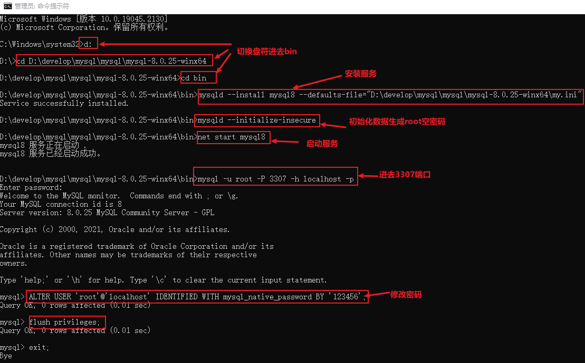

### 3、结果展示，同时开启

1、同时开启

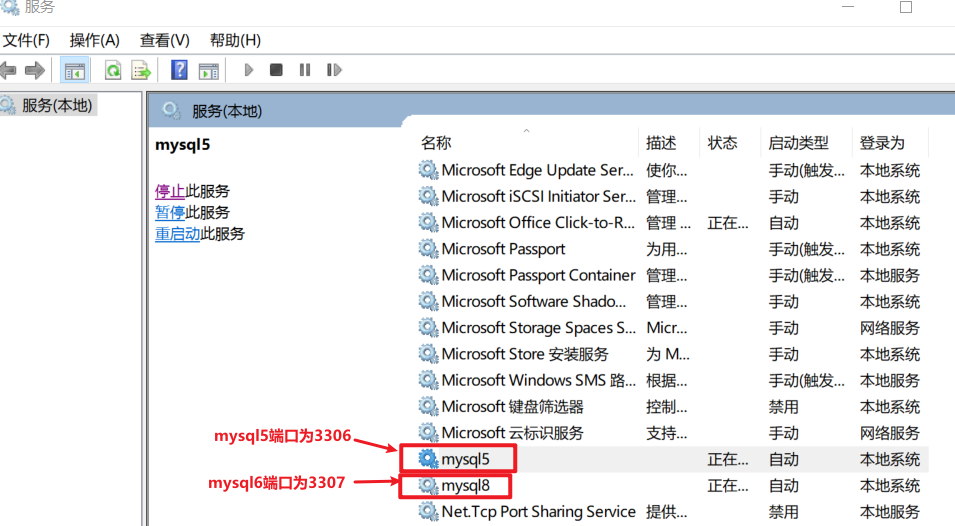

2、并且注册会计表中两个服务指向也正确

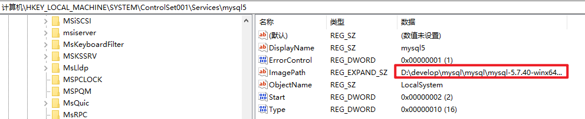

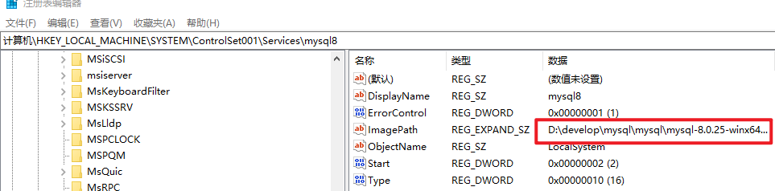