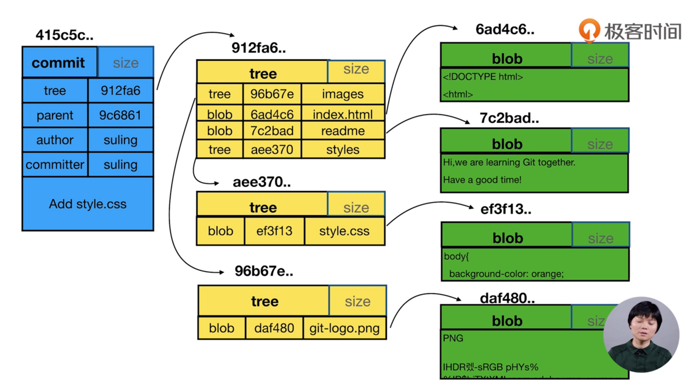
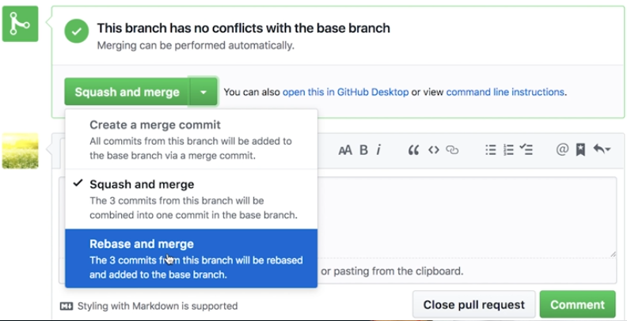
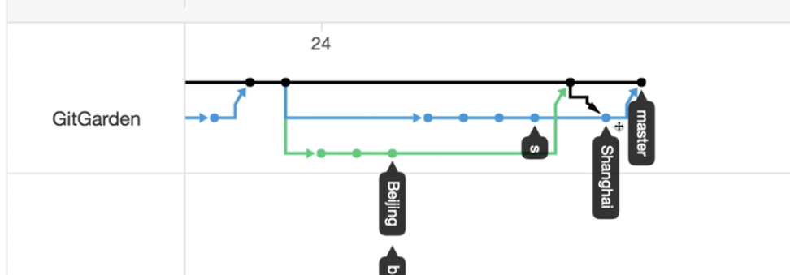
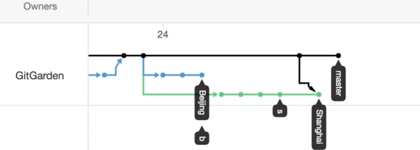
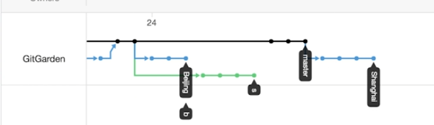
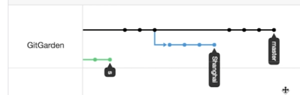
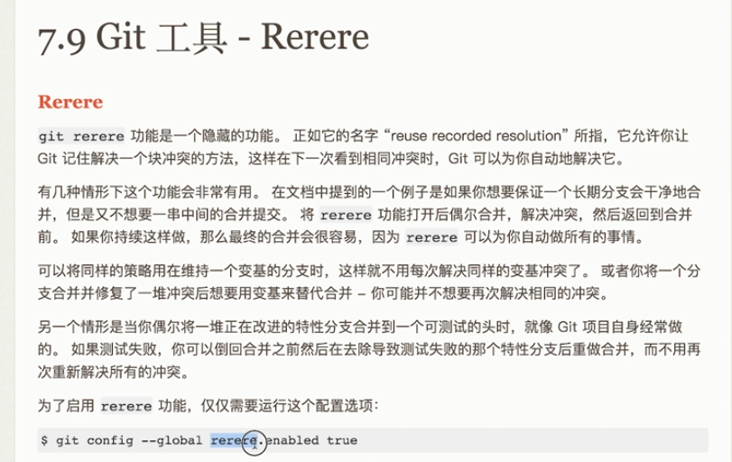

### git基础

1、git配置


```shell
1 工作目录-》暂存区-》历史版本
git add -u
git add xx xxx
git add .

git commit -m'描述' 

2 文件重命名
git mv A B
git reset --hard //清空暂存区

3 gitk查看分支
gitk 
4 git diff A B 分支之间的区别
5 git checkout -b temp nnnnnnnn #创建并切换分支
6 
```

2、git目录

config文件存储配置信息

objects文件夹存储对象

refs文件夹存储索引

\.git\refs\heads文件存储分支

.git\refs\tags文件存储打上标签的文件

3、git中 commit、tree和blob对象之间的差别



4、git清除分支

```shell
git branch -D -d #前一个一定可以删除 后一个有时候不行

git commit --amend #对最近一次commit 进行修改

git rebase -i 父类commit # 修改本地的某次commit信息 reword

git rebase -i 父类commit # 整合commit信息 squash

git diff --cached #暂存区和head进行对比

git diff -- #工作区和暂存区

git reset HEAD # 恢复暂存区为head

git checkout -- file #工作区文件恢复成暂存区内容

git stash 

git branch -av # 显示所有分支
gitk --all # 显示所有历史
git merge --allow-unrelated-history github/master 
#将本地master和远端无历史关系的master合并

$ git remote -v
origin  git@github.com:wzcGGG/javadevelop.git (fetch)
origin  git@github.com:wzcGGG/javadevelop.git (push)

git remote add github git@github.com:wzcGGG/javadevelop.git#首次需要add添加库
git push --all #本地所有分支都推送
$ git clone git@github.com:wzcGGG/javadevelop.git 

git pull 命令用于从远程获取代码并合并本地的版本。
git pull 其实就是 git fetch 和 git merge FETCH_HEAD 的简写

git push -f origin 版本号：master #将master进行强制回退
```

5、视频53的实例演示！！如何做多分枝集成 三者合并的区别



**merge**（分支合并到主、冲突处理m-b-m）



**squash**（本地squash后提交到m，冲突处理Mmerge到B，再提交到m）



**rebase** （使用rerere工具）

```shell
git checkout # 先变换到需要合并的分支
git rebase origin/master # 将上海rebase到master，处理冲突文件
git add . 
git rebase --continue

git push -f origin shanghai # 将本地的shanghai推送到远端
```



在github上在pull选择rebase merge





```shell
git config # 打开配置
git checkout shanghai
git merge master
git add .
git commit 

git reset --hard HEAD~1 # shanghai回退
git rebase master 
```

### github项目部署和gitlab没学习（等学完发开再来补充）
